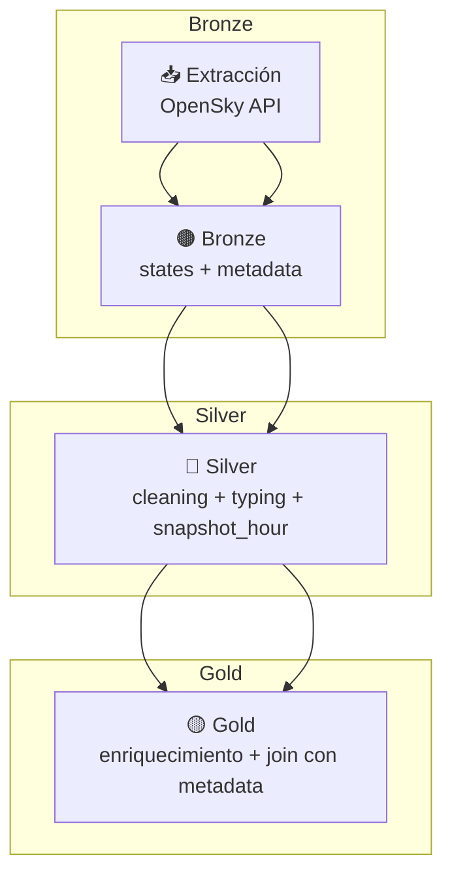

# ✈️ ETL Pipeline de Datos de Aviación (OpenSky Network)

🌐 Disponible en: [English](README_EN.md)

Proyecto de **Ingeniería de Datos** que implementa un pipeline **ETL automatizado** para la ingesta, transformación y almacenamiento de datos dinámicos y estáticos de **OpenSky Network**, organizado en capas **Bronze / Silver / Gold** y orquestado con **Prefect 2.x**.

---

## 🧰 Stack Tecnológico
- **Lenguaje:** Python 3.11  
- **Orquestación:** Prefect **2.x**  
- **Procesamiento:** Pandas  
- **Formato/Tablas:** **Delta Lake** (Parquet + `_delta_log`)  
- **Almacenamiento:** Data Lake local por capas  
- **Versionado:** Git / GitHub  

---

## 🧩 Estructura del pipeline

1. **Ingesta — Bronze**  
   - **Metadatos estáticos:** descarga completa del dataset `aircraftDatabase.csv`.  
   - **Snapshot dinámico:** extracción del endpoint público de estados (`states/all`).  
   - Limpieza mínima y persistencia en Delta Lake.

2. **Transformación — Silver**  
   - **Dinámico:** limpieza profunda, tipificación y creación de columnas temporales (`snapshot_time`, `snapshot_hour`).  
   - **Estático:** estandarización general del esquema y tipos.  
   - Persistencia con particiones por hora.

3. **Curación — Gold**  
   - Enriquecimiento del snapshot dinámico con metadatos estáticos.  
   - Dataset final listo para análisis, visualizaciones o dashboards.

---

## ⚙️ Árbol (simplificado)

```
data/
├── etl_datalake/ # versión orquestada (Prefect)
│ ├── bronze/api_opensky/
│ │ ├── states/
│ │ └── aircraft_metadata/
│ ├── silver/api_opensky/
│ │ ├── states/
│ │ └── aircraft_metadata/
│ └── gold/api_opensky/
│
├── etl_datalake_manual/ # versión manual (Notebook)
│ ├── bronze/api_opensky/
│ │ ├── states/
│ │ └── aircraft_metadata/
│ ├── silver/api_opensky/
│ │ ├── states/
│ │ └── aircraft_metadata/
│ ├── gold/api_opensky/
│ └── exports/
│
src/
├── etl_opensky_flow.py # flujo orquestado con Prefect
└── etl_utils.py # utilidades y funciones auxiliares

notebooks/
├── ETL_OpenSky_Manual.ipynb # versión manual
└── ETL_OpenSky_Prefect.ipynb # versión orquestada
```

---

## 🗺️ Diagrama del pipeline (Mermaid)



---

## 📊 Resultados principales
- Pipeline completo **Static → Bronze → Silver → Gold**  
- Snapshots dinámicos particionados por hora  
- Enriquecimiento automático con metadatos técnicos  
- Orquestación con Prefect (reintentos, logging, seguimiento de ejecuciones)

---

## 🧠 Conclusión
Pipeline **robusto**, **modular** y **escalable** para análisis recurrente del tráfico aéreo.  
Preparado para migrar a entornos cloud (Azure / GCP / Databricks).

---

## ✍️ Autor
**Elías Fernández**  
📧 fernandezelias86@gmail.com  
🔗 LinkedIn: https://www.linkedin.com/in/eliasfernandez208

---

📁 **Repositorio:** ETL_OpenSky_Aviation