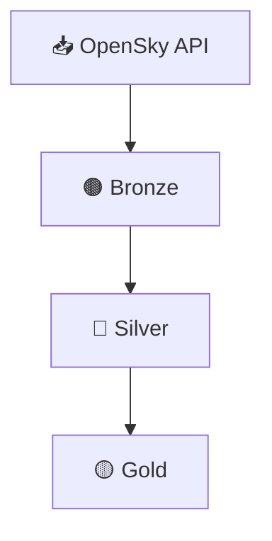

# ✈️ ETL Pipeline de Datos de Aviación (OpenSky Network)

🌐 **Available in English:** [README_EN.md](README_EN.md)


Proyecto de **Ingeniería de Datos** que implementa un pipeline **ETL** para la ingesta, transformación y almacenamiento de datos dinámicos y estáticos de **OpenSky Network**, organizado en capas **Bronze / Silver / Gold**.

El proyecto contempla **tres modos de ejecución** claramente diferenciados:  
- ejecución **local manual**,  
- ejecución **local orquestada con Prefect**,  
- y una **versión cloud validada en Azure Databricks**.

---

## 🧰 Stack Tecnológico

- **Lenguaje:** Python 3.11  
- **Procesamiento local:** Pandas  
- **Procesamiento distribuido:** Apache Spark (PySpark)  
- **Orquestación:** Prefect 2.x  
- **Formato / tablas:** Delta Lake  
- **Almacenamiento:** Data Lake por capas  
- **Versionado:** Git / GitHub  

---

## 🧩 Estructura del pipeline

### 1️⃣ Ingesta — Bronze
- **Metadatos estáticos:** descarga completa del dataset `aircraftDatabase.csv`.
- **Snapshot dinámico:** extracción del endpoint público `states/all`.
- Persistencia en Delta Lake con mínima transformación.

### 2️⃣ Transformación — Silver
- Limpieza profunda, tipificación de columnas y validaciones.
- Creación de columnas temporales (`snapshot_time`, `snapshot_hour`).
- Persistencia particionada por hora.

### 3️⃣ Curación — Gold
- Enriquecimiento del snapshot dinámico con metadatos estáticos.
- Dataset final listo para análisis, visualización o consumo analítico.

---

## ⚙️ Estructura del proyecto (simplificada)

```
ETL_OPENSKY_AVIATION/
├── cloud/
│   └── databricks/
│       ├── opensky_etl.ipynb        # ETL manual adaptado a Spark (Azure Databricks)
│       └── etl_utils.py             # Utilidades (versión cloud)
│
├── local/
│   ├── notebooks/
│   │   ├── opensky_etl_manual.ipynb        # ETL manual (pandas)
│   │   └── opensky_etl_orchestration.ipynb # Ejecución orquestada con Prefect
│   │
│   ├── src/
│   │   ├── etl_utils.py             # Funciones auxiliares compartidas
│   │   └── etl_opensky_flow.py      # Flow de Prefect
│   │
│   └── data/
│       ├── etl_datalake_manual/         # Outputs del ETL manual
│       │   ├── bronze/
│       │   ├── silver/
│       │   ├── gold/
│       │   └── exports/
│       │
│       └── etl_datalake_orchestrated/   # Outputs del ETL orquestado
│           ├── bronze/
│           ├── silver/
│           └── gold/
│
├── pipeline.conf
├── requirements.txt
├── README.md
└── README_EN.md
```

---

## ☁️ Versión Cloud — Azure Databricks

El pipeline fue **adaptado, ejecutado y validado en Azure Databricks**, utilizando Apache Spark como motor de procesamiento distribuido.

- Implementación **manual** (sin orquestación).
- Eliminación del uso de pandas en favor de **Spark DataFrames**.
- Persistencia de los datos en **contenedores de Azure Storage**, siguiendo la misma arquitectura por capas **Bronze / Silver / Gold**.
- El cluster fue **apagado tras la validación funcional** para evitar costos recurrentes.

El código cloud queda disponible como referencia **cloud-ready** dentro del repositorio.

---

## 🗺️ Diagrama del pipeline



---

## 📊 Resultados principales

- Pipeline ETL completo y reproducible
- Separación clara entre ejecución local y cloud
- Orquestación con Prefect (reintentos, logging, tracking)
- Adaptación exitosa de pandas → Spark
- Estructura limpia y orientada a portfolio profesional

---

## 🧠 Conclusión

Proyecto **modular y escalable**, orientado a la reproducibilidad y preparado para ejecución en entornos cloud, implementado siguiendo buenas prácticas de Ingeniería de Datos.

---

## ✍️ Autor

**Elías Fernández**  
📧 fernandezelias86@gmail.com  
🔗 LinkedIn: [Perfil](https://www.linkedin.com/in/eliasfernandez208)

---

📁 **Repositorio:** ETL_OpenSky_Aviation