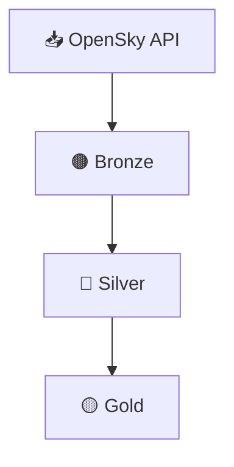

# ✈️ Aviation Data ETL Pipeline (OpenSky Network)

🌐 Disponible en [Español](README.md)


**Data Engineering** project that implements an **ETL pipeline** for ingesting, transforming, and storing both dynamic and static aviation data from **OpenSky Network**, organized using a **Bronze / Silver / Gold** layered architecture.

The project includes **three clearly differentiated execution modes**:
- **local manual execution**,  
- **local Prefect-orchestrated execution**,  
- and a **cloud-ready version validated on Azure Databricks**.

---

## ▶️ How to Run (quickstart)

> Configure `pipeline.conf` first, then choose one of the three execution modes:

- **Local (Pandas + Delta Lake):** run `local/notebooks/opensky_etl_manual.ipynb`.
- **Orchestrated (Prefect):** run the flow `local/src/etl_opensky_flow.py` (or `local/notebooks/opensky_etl_orchestration.ipynb`).
- **Cloud (Azure Databricks + Spark):** import and run `cloud/databricks/opensky_etl.ipynb`.

---

## 🧰 Technology Stack

- **Language:** Python 3.11  
- **Local processing:** Pandas  
- **Distributed processing:** Apache Spark (PySpark)  
- **Orchestration:** Prefect 2.x  
- **Storage format:** Delta Lake  
- **Storage layer:** Layered Data Lake  
- **Version control:** Git / GitHub  

---

## 🧩 Pipeline Architecture

### 1️⃣ Ingestion — Bronze
- **Static metadata:** full download of the `aircraftDatabase.csv` dataset.
- **Dynamic snapshot:** extraction from the public `states/all` endpoint.
- Persistence in Delta Lake with minimal transformations.

### 2️⃣ Transformation — Silver
- Deep cleaning, type casting, and validation.
- Creation of temporal columns (`snapshot_time`, `snapshot_hour`).
- Hourly-partitioned persistence.

### 3️⃣ Curation — Gold
- Enrichment of dynamic snapshots with static metadata.
- Final dataset ready for analytics, visualization, or downstream consumption.

---

## ⚙️ Project Structure (overview)

```
ETL_OPENSKY_AVIATION/
├── cloud/
│   └── databricks/
│       ├── opensky_etl.ipynb        # Manual ETL adapted to Spark (Azure Databricks)
│       └── etl_utils.py             # Historical compatibility / reference
│
├── local/
│   ├── notebooks/
│   │   ├── opensky_etl_manual.ipynb        # Manual ETL (pandas)
│   │   └── opensky_etl_orchestration.ipynb # Prefect-orchestrated execution
│   │
│   ├── src/
│   │   ├── etl_utils.py             # Shared helper functions
│   │   └── etl_opensky_flow.py      # Prefect flow definition
│   │
│   └── data/
│       ├── etl_datalake_manual/         # Manual ETL outputs
│       │   ├── bronze/
│       │   ├── silver/
│       │   ├── gold/
│       │   └── exports/
│       │
│       └── etl_datalake_orchestrated/   # Orchestrated ETL outputs
│           ├── bronze/
│           ├── silver/
│           └── gold/
│
├── pipeline.conf
├── requirements.txt
├── README.md
└── README_EN.md
```

---

## ☁️ Cloud Version — Azure Databricks

The pipeline was **adapted, executed, and validated on Azure Databricks**, using Apache Spark as the distributed processing engine.

- **Manual implementation** (without orchestration).
- Migration from pandas to **Spark DataFrames**.
- Data persistence in **Azure Storage containers**, following the same **Bronze / Silver / Gold** architecture.
- The cluster was **shut down after functional validation** to avoid recurring costs.

> **Note:** The cloud infrastructure used during development is no longer active. Current validation and maintenance are performed through the local implementation based on Python, Pandas, and Delta Lake. The Databricks version is retained as a reference of the adaptation and validation work carried out on Azure.

The cloud code remains available within the repository as a **cloud-ready reference**.

---

## 🗺️ Pipeline Diagram



---

## 📊 Key Outcomes

- **End-to-end** ETL pipeline with **Bronze/Silver/Gold** layered persistence.
- Ingestion of **static data** (`aircraftDatabase.csv`) + **dynamic snapshots** (`states/all`).
- Data quality + type casting transformations, including temporal columns (`snapshot_time`, `snapshot_hour`).
- **Hourly-partitioned** persistence in Silver to improve organization and querying.
- Three consistent execution modes: **Pandas+Delta (local)**, **Prefect (orchestrated)**, and **Spark (cloud)**.

---

## 🧾 Conclusion

A **modular and scalable** project focused on reproducibility and cloud-ready execution, implemented following Data Engineering best practices.

---

## 🪪 License
This project is distributed under the MIT License.  
See the [LICENSE](LICENSE) file.

---

## ✍️ Author
**Elías Fernández**

---

## 📫 Contact
📧 [fernandezelias86@gmail.com](mailto:fernandezelias86@gmail.com)  
🔗 LinkedIn: [Profile](https://www.linkedin.com/in/eliasfernandez208)
