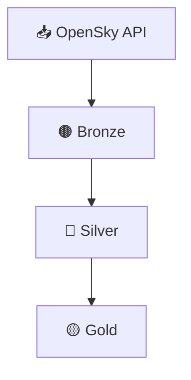

# ✈️ Aviation Data ETL Pipeline (OpenSky Network)

🌐 Disponible en [Español](README.md)


**Data Engineering** project that implements an **ETL pipeline** for ingesting, transforming, and storing both dynamic and static aviation data from **OpenSky Network**, organized using a **Bronze / Silver / Gold** layered architecture.

The project includes **three clearly differentiated execution modes**:
- **local manual execution**,  
- **local Prefect-orchestrated execution**,  
- and a **cloud-ready version validated on Azure Databricks**.

---

## 🧰 Technology Stack

- **Language:** Python 3.11  
- **Local processing:** Pandas  
- **Distributed processing:** Apache Spark (PySpark)  
- **Orchestration:** Prefect 2.x  
- **Storage format:** Delta Lake  
- **Storage layer:** Layered Data Lake  
- **Version control:** Git / GitHub  

---

## 🧩 Pipeline Architecture

### 1️⃣ Ingestion — Bronze
- **Static metadata:** full download of the `aircraftDatabase.csv` dataset.
- **Dynamic snapshot:** extraction from the public `states/all` endpoint.
- Persistence in Delta Lake with minimal transformations.

### 2️⃣ Transformation — Silver
- Deep cleaning, type casting, and validation.
- Creation of temporal columns (`snapshot_time`, `snapshot_hour`).
- Hourly-partitioned persistence.

### 3️⃣ Curation — Gold
- Enrichment of dynamic snapshots with static metadata.
- Final dataset ready for analytics, visualization, or downstream consumption.

---

## ⚙️ Project Structure (simplified)

```
ETL_OPENSKY_AVIATION/
├── cloud/
│   └── databricks/
│       ├── opensky_etl.ipynb        # Manual ETL adapted to Spark (Azure Databricks)
│       └── etl_utils.py             # Helper utilities (cloud version)
│
├── local/
│   ├── notebooks/
│   │   ├── opensky_etl_manual.ipynb        # Manual ETL (pandas)
│   │   └── opensky_etl_orchestration.ipynb # Prefect-orchestrated execution
│   │
│   ├── src/
│   │   ├── etl_utils.py             # Shared helper functions
│   │   └── etl_opensky_flow.py      # Prefect flow definition
│   │
│   └── data/
│       ├── etl_datalake_manual/         # Manual ETL outputs
│       │   ├── bronze/
│       │   ├── silver/
│       │   ├── gold/
│       │   └── exports/
│       │
│       └── etl_datalake_orchestrated/   # Orchestrated ETL outputs
│           ├── bronze/
│           ├── silver/
│           └── gold/
│
├── pipeline.conf
├── requirements.txt
├── README.md
└── README_EN.md
```

---

## ☁️ Cloud Version — Azure Databricks

The pipeline was **adapted, executed, and validated on Azure Databricks**, using Apache Spark as the distributed processing engine.

- **Manual execution only** (no orchestration).
- Pandas was fully replaced by **Spark DataFrames**.
- Data was persisted to **Azure Storage containers**, following the same **Bronze / Silver / Gold** layered architecture.
- The Databricks cluster was **shut down after functional validation** to avoid recurring costs.

The cloud code remains available as a **cloud-ready reference** within the repository.

---

## 🗺️ Pipeline Diagram



---

## 📊 Key Outcomes

- Fully reproducible ETL pipeline
- Clear separation between local and cloud execution
- Prefect-based orchestration (retries, logging, execution tracking)
- Successful migration from pandas to Spark
- Clean, portfolio-oriented project structure

---

## 🧠 Conclusion

A **modular and scalable** project focused on reproducibility and cloud-ready execution, implemented following Data Engineering best practices.

---

## ✍️ Author
**Elías Fernández**  
📧 Contact: fernandezelias86@gmail.com  
🔗 LinkedIn: [Perfil](https://www.linkedin.com/in/eliasfernandez208)

---

📁 **Repository:** ETL_OpenSky_Aviation
