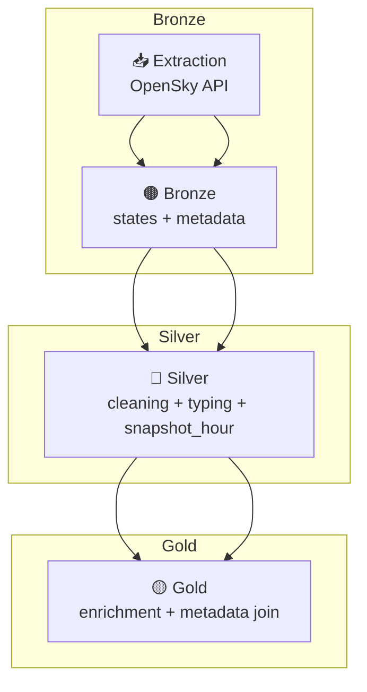

# ✈️ Aviation Data ETL Pipeline (OpenSky Network)

🌐 Disponible en: [Español](README.md)

Data Engineering project implementing an automated **ETL pipeline** for ingesting, transforming, and storing **OpenSky Network** dynamic and static datasets, using a **Bronze / Silver / Gold** layered architecture and **Prefect 2.x** orchestration.

---

## 🧰 Tech Stack
- **Language:** Python 3.11  
- **Orchestration:** Prefect 2.x  
- **Processing:** Pandas  
- **Format/Tables:** Delta Lake  
- **Storage:** Local layered Data Lake  
- **Version Control:** Git / GitHub  

---

## 🧩 Pipeline structure

1. **Ingestion — Bronze**  
   - Static metadata (`aircraftDatabase.csv`)  
   - Dynamic state snapshots (`states/all`)  
   - Minimal cleanup and Delta Lake persistence  

2. **Transformation — Silver**  
   - Deep cleaning, typing, temporal columns  
   - Static metadata standardization  
   - Hour-partitioned storage  

3. **Curation — Gold**  
   - Enrichment by joining dynamic + static datasets  
   - Final dataset ready for analysis and visualization  

---

## ⚙️ Tree Structure (simplified)

```
data/
├── etl_datalake/ # orchestrated version
│ ├── bronze/api_opensky/
│ ├── silver/api_opensky/
│ └── gold/api_opensky/
│
├── etl_datalake_manual/
│ ├── bronze/api_opensky/
│ ├── silver/api_opensky/
│ ├── gold/api_opensky/
│ └── exports/
│
src/
├── etl_opensky_flow.py
└── etl_utils.py

notebooks/
├── ETL_OpenSky_Manual.ipynb
└── ETL_OpenSky_Prefect.ipynb
```

---



---

## 📊 Key Results
- Full pipeline **Static → Bronze → Silver → Gold**  
- Hour-partitioned snapshots  
- Automated enrichment with aircraft metadata  
- Prefect orchestration  

---

## ✍️ Author
**Elías Fernández**  
📧 fernandezelias86@gmail.com  
🔗 LinkedIn: https://www.linkedin.com/in/eliasfernandez208
