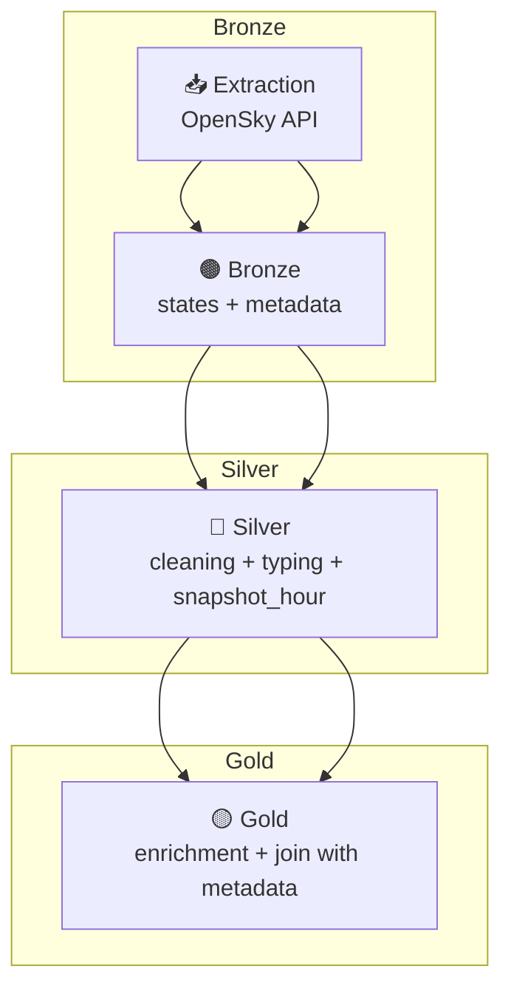

# ✈️ Aviation Data ETL Pipeline (OpenSky Network)

🌐 Disponible en: [Español](README.md)

Data Engineering project implementing an **end‑to‑end ETL pipeline** for extracting, transforming, and storing **OpenSky Network** dynamic aircraft states and static metadata.  
The architecture follows **Bronze / Silver / Gold** layers and is orchestrated with **Prefect 2.x**.

---

## 🧰 Tech Stack
- **Language:** Python 3.11  
- **Orchestration:** Prefect **2.x**  
- **Processing:** Pandas  
- **Format/Tables:** **Delta Lake**  
- **Storage:** Layered local Data Lake  
- **Version control:** Git / GitHub  

---

## 🧩 Pipeline Overview

1. **Ingestion — Bronze**  
   - **Static metadata:** full download of `aircraftDatabase.csv`.  
   - **Dynamic snapshot:** extraction from the public states endpoint (`states/all`).  
   - Minimal cleaning and storage in Delta Lake.

2. **Transformation — Silver**  
   - **Dynamic:** deep cleaning, type casting, time enrichment (`snapshot_time`, `snapshot_hour`).  
   - **Static:** schema standardization.  
   - Partitioning by hour for time‑series analysis.

3. **Curation — Gold**  
   - Enrichment of dynamic snapshots with aircraft static metadata.  
   - Final dataset ready for analytics and visualization.

---

## ⚙️ Tree Structure (simplified)

```
data/etl_datalake/
├── bronze/api_opensky/
│   ├── states/
│   └── aircraft_metadata/
├── silver/api_opensky/
│   ├── states/
│   └── aircraft_metadata/
├── gold/api_opensky/
└── exports/

src/
├── etl_opensky_flow.py
└── etl_utils.py

notebooks/
├── ETL_OpenSky_Manual.ipynb     # manual version
└── ETL_OpenSky_Prefect.ipynb    # orchestrated version
```

---



---

## 📊 Key Results
- Full **Static → Bronze → Silver → Gold** workflow.  
- Hour‑partitioned dynamic air‑traffic snapshots.  
- Automated enrichment with aircraft technical metadata.  
- Prefect orchestration with retries, logging, and run tracking.  

---

## 🧠 Conclusion
A **reliable**, **modular**, and **cloud‑ready** ETL pipeline suitable for recurrent air‑traffic analytics.

---

## ✍️ Author
**Elías Fernández**  
📧 fernandezelias86@gmail.com  
🔗 LinkedIn: www.linkedin.com/in/eliasfernandez208

---

📁 **Repository:** ETL_OpenSky_Aviation
